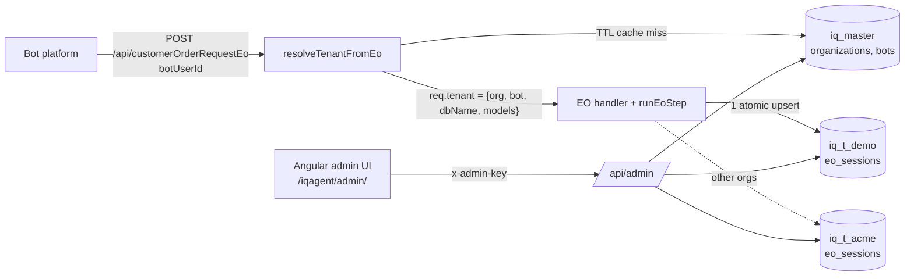

# node-prod-api

Express 5 + MongoDB (mongoose) API in CommonJS (Node 18.18+, Node 22 LTS recommended), organised in feature modules.

Includes: a **master + tenant (database-per-organization) architecture**, an **admin API** and an **Angular admin UI**, plus validated env config (zod), winston logging with env-driven weekly/daily rotation, helmet, CORS, compression, a JSON body size limit, central error handling + JSON 404, health/readiness endpoints, MongoDB connection with retry/reconnect, graceful shutdown, crash logging, Angular static hosting under a sub-path, and the EO bot endpoint with reusable EO helpers and per-tenant conversation history.

## Quick start

```bash
npm install
cp .env.example .env        # then edit .env (MONGODB_URI, ADMIN_API_KEY, ...)
npm run seed                # demo organization + bot 3183 (idempotent)
npm run client:install && npm run client:build   # admin UI -> public/admin/browser
npm run dev                 # node --watch, pretty colourised console logs
```

```bash
curl localhost:3000/iqagent/health
curl -X POST localhost:3000/iqagent/api/customerOrderRequestEo \
  -H 'Content-Type: application/json' -d @tests/fixtures/eoRequest.json
open http://localhost:3000/iqagent/admin/       # admin UI (sign in with ADMIN_API_KEY)
```

| Script | What it does |
|---|---|
| `npm start` / `npm run dev` | Run the API (plain node / `node --watch`) |
| `npm test` | node:test + supertest; tests needing MongoDB start a real `mongod` via mongodb-memory-server (binary 7.0.24 is downloaded once and cached) |
| `npm run lint` / `lint:fix` | ESLint (`reference/`, `client/`, `public/` are ignored) |
| `npm run seed` | Create the demo organization + bot (safe to re-run) |
| `npm run client:install` | `npm ci` in `client/` |
| `npm run client:build` | Production build of the admin UI into `public/admin/browser` (base href `/iqagent/admin/`) |
| `npm run client:dev` | `ng serve` on :4200 with a proxy for `/iqagent/api` → `localhost:3000` |

## Multi-tenant design

One mongoose connection (`MONGODB_URI`) serves every database through `connection.useDb(name, { useCache: true })`; models are registered once per database and cached (`getMasterModels()`, `getTenantModels(dbName)` in `src/shared/tenancy`).



**Master DB** (`MASTER_DB_NAME`, default `iq_master`)

| Collection | Fields |
|---|---|
| `organizations` | `orgId` (unique slug `^[a-z0-9][a-z0-9-]*[a-z0-9]$`, immutable), `name`, `legalName`, `email`, `phone`, `address{line1,line2,city,state,postalCode,country}`, `currencyCode` (ISO 4217, default `USD`), `timezone` (IANA, default `Asia/Calcutta`), `logoUrl`, `dbName` (`iq_t_<orgId>` with `-` → `_`, immutable), `status` `active`/`suspended`, `settings` (object), timestamps |
| `bots` | `botUserId` (unique, immutable), `botDatabaseName`, `name`, `orgId`, `channel` (default `cybot`), `status` `active`/`inactive`, `config` (object), timestamps |

**Tenant DB** (`iq_t_<orgId>`, created with its indexes when the organization is created)

| Collection | Fields |
|---|---|
| `eo_sessions` | unique key **(`sessionDate`, `botUserId`, `taskId`)**; static fields stored once on insert (`botDatabaseName`, `taskNo`, `fromId`, `fromEmail`, `toId`, `databaseName`, `env`, `deviceId`, `localTimeZone`, `createdDate` (verbatim string), `firstMessageAt`); `messages[]` (`direction` in/out, `signalId`, `parentId`, `questionKey`, `answerKey`, `expectedAns`, `answerText`, `mimeType`, `eoState`, `resultCode`, `resultText`, `at`); `messageCount`, `lastMessageAt`, `lastEoState`; timestamps. Indexes: the unique key and `lastMessageAt` |

**Request flow (`POST /api/customerOrderRequestEo`)**

1. `resolveTenantFromEo` reads `body.botUserId` and calls `getTenantContextByBotUserId()`: bot → organization from the master DB, cached per process for `TENANT_CACHE_TTL_SECONDS` (only complete bot+org pairs are cached; status is re-checked on every hit). Unknown/inactive bot, missing/suspended organization or a lookup failure is logged and answered with **HTTP 200 + `buildEoError(...)`** carrying a user-facing message.
2. The handler runs (`runEoStep`, the tenant is passed as the handler's 3rd argument).
3. `recordEoExchange()` (`src/shared/eo/session.service.js`, reusable by any EO module) stores the inbound message and the reply with **one** `findOneAndUpdate(..., { upsert: true })` (`$setOnInsert` static fields, `$push` both messages, `$inc` `messageCount`). It never throws: a failed save (or a payload without `sessionDate`/`taskId`) is logged as `eo.session_save_failed` / `eo.session_skipped` and the reply is sent unchanged.

The admin API invalidates cache entries when a bot or organization changes (`invalidateTenantCache({ botUserId, orgId })`). The cache is per process, so other instances see the change after the TTL.

## Admin API (`/api/admin`)

- **Auth:** header `x-admin-key: <ADMIN_API_KEY>` (compared in constant time). Required in production (startup fails without `ADMIN_API_KEY`); when unset in development/test the API is open and `admin.auth_disabled` is logged once.
- **DB guard:** every route except `/auth/check` answers `503 DATABASE_UNAVAILABLE` while MongoDB is disconnected.
- **Responses:** `{ "success": true, "data": ..., "meta"?: { "page", "limit", "total", "pages" } }`; errors keep the global shape `{ "error": { "message", "code", "details?" } }`. Bodies are validated strictly (unknown keys → 400 `VALIDATION_ERROR`). Lists take `page` (default 1) and `limit` (default 20, max 100).

| Method | Path | Description |
|---|---|---|
| GET | `/auth/check` | `{ ok, authRequired }` - used by the UI sign-in |
| GET | `/stats` | Organizations/bots by status, session totals (all / last 24 h) and per-organization numbers (max 100 orgs, `perOrganizationTruncated`) |
| GET | `/organizations` | List; `q` (name/orgId/email), `status`, `sort` (`name`, `orgId`, `createdAt`, `updatedAt`, `-` prefix = descending; default `-createdAt`), each item has `botCount` |
| POST | `/organizations` | Create (`orgId` optional: generated from the name) and initialise its tenant DB; `409 ORG_EXISTS` |
| GET | `/organizations/:orgId` | Detail with `botCount`, `activeBotCount`, `sessionCount` |
| PATCH | `/organizations/:orgId` | Partial update (nested `address` merged); `orgId`/`dbName` → `400 IMMUTABLE_FIELD` |
| PATCH | `/organizations/:orgId/status` | `{ "status": "active" \| "suspended" }` |
| DELETE | `/organizations/:orgId` | Delete the record; `409 ORG_HAS_BOTS` while bots reference it. The tenant DB is kept |
| GET | `/organizations/:orgId/sessions` | EO sessions of the tenant, newest activity first, with a `lastMessage` summary; filter `botUserId` |
| GET | `/organizations/:orgId/sessions/:id` | One session with its full `messages` timeline |
| GET | `/bots` | List; `q` (botUserId/name/botDatabaseName), `orgId`, `status`, `sort` (`name`, `botUserId`, `createdAt`, `updatedAt`, optional `-`); each item has `organization {orgId, name, status}` |
| POST | `/bots` | Create; `422 ORG_NOT_FOUND`, `409 BOT_EXISTS` |
| GET | `/bots/:botUserId` | Detail |
| PATCH | `/bots/:botUserId` | Update (`name`, `botDatabaseName`, `channel`, `orgId`, `config`); `botUserId` is immutable |
| PATCH | `/bots/:botUserId/status` | `{ "status": "active" \| "inactive" }` |
| DELETE | `/bots/:botUserId` | Delete (its sessions stay in the tenant DB) |

```bash
curl -H "x-admin-key: $ADMIN_API_KEY" localhost:3000/iqagent/api/admin/organizations
curl -X POST -H "x-admin-key: $ADMIN_API_KEY" -H 'Content-Type: application/json' \
  -d '{"name":"Acme Kitchens","email":"ops@acme.example","currencyCode":"USD"}' \
  localhost:3000/iqagent/api/admin/organizations
```

## Seed data

`npm run seed` connects with `MONGODB_URI`, ensures the master indexes and upserts (only `$setOnInsert`, so existing records are never overwritten):

- organization `demo` / **Demo Cabinets** (tenant DB `iq_t_demo`, created with its indexes)
- bot `3183` / `SYSTEMBOT63183` → `demo` (matches `tests/fixtures/eoRequest.json`)

## Admin UI (`client/`)

Angular 22 (standalone components, signals, zoneless, lazy routes), Angular Material 3 with a custom indigo/teal theme, Inter font, light mode by default with a dark toggle (saved in localStorage). Needs **Node 22.12+** to build.

| Page | Route (under `/iqagent/admin/`) |
|---|---|
| Sign in | `login` - enter the admin key; it is checked with `/auth/check` and kept in localStorage only (skipped when the server needs no key) |
| Dashboard | `dashboard` - stat cards + per-organization activity |
| Organizations | `organizations`, `organizations/new`, `organizations/:orgId`, `organizations/:orgId/edit` |
| Session detail | `organizations/:orgId/sessions/:sessionId` - request details + chat timeline |
| Bots | `bots`, `bots/new?orgId=...`, `bots/:botUserId/edit` |

- An HTTP interceptor adds `x-admin-key`; a 401 sends you back to the sign-in page.
- The API base is relative (`../api/admin/` resolved against `<base href>`), so the same build works at `/iqagent/admin/` behind nginx or any other prefix.
- Build: `npm run client:build` (`ng build`, base href `/iqagent/admin/`, output `public/admin/browser`, git-ignored). Serve it from this process with `ANGULAR_ENABLED=true`, `ANGULAR_APP_NAME=admin`, `ANGULAR_DIST_PATH=./public/admin/browser`.
- Develop: run the API on :3000 and `npm run client:dev`, then open `http://localhost:4200/iqagent/admin/` (`client/proxy.conf.json` forwards `/iqagent/api`).

```
client/src/app
├── app.ts, app.config.ts, app.routes.ts   # root, providers, lazy routes
├── core        # models, AdminApi (HTTP), admin key service + interceptor + guard, theme, toasts, error helpers
├── shared      # confirm dialog, status chip, empty state, pipes (timeAgo, sessionDate, initials)
├── layout      # shell: responsive sidenav + top bar ("IQ Agent Admin"), theme toggle, account menu
└── features    # login, dashboard, organizations (list/form/detail), bots (list/form), sessions (detail)
```

## Endpoints

Every module is served at the root **and** under `APP_BASE_PATH` (default `/iqagent`, which nginx forwards unchanged).

| Method | Path | Description |
|---|---|---|
| GET | `/health`, `/health/live` | Liveness: always 200; uptime, memory and MongoDB state |
| GET | `/health/ready` | Readiness: 200 when MongoDB is connected and not shutting down, otherwise 503 |
| POST | `/api/customerOrderRequestEo` | EO bot conversation step (see below), routed to the bot's tenant |
| * | `/api/admin/...` | Admin API (see [Admin API](#admin-api-apiadmin)) |
| GET | `/<ANGULAR_APP_NAME>/...` | Angular build, e.g. the admin UI at `/iqagent/admin/` (only under `APP_BASE_PATH`, when enabled) |

Errors always look like `{ "error": { "message", "code", "details?" } }`.

## Folder structure

```
src
├── app.js                       # Express app: middleware order, module routes, 404 + errors
├── server.js                    # entry point: HTTP server, Mongo connect, signals, shutdown
├── config
│   ├── index.js                 # dotenv + zod env validation -> frozen config object
│   ├── logger.js                # winston logger, rotating files, flushLogger()
│   └── database.js              # mongoose connect with retry/backoff, events, close
├── routes
│   └── index.js                 # module registry: path -> module router
├── shared
│   ├── eo                       # EO toolkit reused by every EO API
│   │   ├── constants.js         #   EO_RESULT, EO_STATE
│   │   ├── helpers.js           #   base64, signal ids, decodeContext, builders, resolveHandler, runEoStep
│   │   ├── session.service.js   #   recordEoExchange(): one atomic upsert per request into eo_sessions
│   │   └── index.js             #   public entry point
│   ├── tenancy                  # master + tenant databases
│   │   ├── constants.js         #   statuses, model/collection names, TENANT_DB_PREFIX, ORG_ID_PATTERN
│   │   ├── schemas/             #   organization, bot (master), eoSession (tenant)
│   │   ├── models.js            #   getMasterModels, getTenantModels, buildTenantDbName, ensureMasterIndexes, initTenantDatabase
│   │   ├── ttlCache.js          #   small in-memory TTL cache
│   │   ├── tenantContext.js     #   getTenantContextByBotUserId, invalidateTenantCache, TenantResolutionError
│   │   ├── resolveTenantFromEo.js #  EO middleware -> req.tenant or HTTP 200 buildEoError
│   │   └── index.js
│   ├── middlewares              # requestLogger, errorHandler, notFound, angularStatic, adminAuth, requireDb
│   └── utils                    # AppError, asyncHandler, truncate, apiResponse (sendSuccess), query (pagination)
└── modules
    ├── health                   # health.routes.js, health.controller.js
    ├── admin                    # /api/admin
    │   ├── admin.routes.js      #   auth -> no-store -> /auth/check -> requireDb -> sub-routers
    │   ├── validation.js        #   shared zod field helpers
    │   ├── organizations/       #   schemas, service, controller, routes (incl. tenant sessions)
    │   ├── bots/                #   schemas, service, controller, routes
    │   ├── sessions/            #   sessions.service.js (tenant eo_sessions queries)
    │   └── stats/               #   stats.service.js, stats.controller.js
    └── customerOrderRequestEo
        ├── customerOrderRequestEo.routes.js
        ├── customerOrderRequestEo.controller.js   # HTTP + EO logging
        ├── customerOrderRequestEo.service.js      # runs the step against the handler registry
        ├── constants.js                           # question/answer keys
        └── handlers                               # index.js (registry), default + customerMenu handlers
scripts/seed.js                  # npm run seed
client/                          # Angular admin UI (see Admin UI)
tests                            # mirrors src: modules/, shared/, config/, plus app/health/angular; helpers/testDb.js
```

## How to add a new API module

1. Create `src/modules/<name>/`:
   ```
   src/modules/<name>/
   ├── <name>.routes.js       # const router = Router(); router.post('/', asyncHandler(controller)); module.exports = router;
   ├── <name>.controller.js   # req/res only: read input, call the service, send the response
   ├── <name>.service.js      # business logic (and DB access via a model, if any)
   ├── <name>.model.js        # optional mongoose model
   └── constants.js           # optional
   ```
   For an EO API, copy `modules/customerOrderRequestEo` and give it its own `handlers/` registry; the service is a one-liner around `runEoStep(payload, { registry, defaultHandler })` from `shared/eo`.
2. Register the router in `src/routes/index.js`:
   ```js
   { path: '/api/<name>', router: require('../modules/<name>/<name>.routes') },
   ```
   It is then served at `/api/<name>` and `${APP_BASE_PATH}/api/<name>`.
3. Add tests in `tests/modules/<name>.test.js`.

Throw `AppError` (or `AppError.notFound()`, ...) for expected errors; anything else becomes a generic 500. For DB-backed routes, check `getDatabaseState().isConnected` from `config/database` if you want a fast 503 while MongoDB is down.

## EO endpoint: `POST /api/customerOrderRequestEo`

- **Flow:** `resolveTenantFromEo` (botUserId → organization, see [Multi-tenant design](#multi-tenant-design)) → `decodeContext(body.context)` → `resolveHandler(questionKey, answerKey, registry, defaultHandler)` → `handler(payload, decoded, tenant)` → `buildEoResponse(...)` → `recordEoExchange(...)` → HTTP 200 JSON.
- **Always HTTP 200:** missing payload fields just come back `undefined`; tenant errors (unknown/inactive bot, suspended organization, MongoDB unavailable) become a `buildEoError(...)` reply with a readable message, and a failed session save never changes the reply.
- **Errors:** if a handler throws, `eo.handler_error` is logged and the reply is still **HTTP 200** with a `buildEoError(...)` body (`resultCode '1'`, `resultText 'failure'`, `eoState 'stop'`). The failure values are placeholders until the platform confirms them (`src/shared/eo/constants.js`).

Response shape (`req` = `body.reqMessageObj`):

```json
{
  "resultCode": "0", "resultText": "success",
  "resMessageObj": { "taskId": "<req.taskId>", "fromId": "<body.botUserId>", "signalId": "<new 17-digit id>",
                     "parentId": "<req.signalId>", "mimeType": "text", "databaseName": "<req.databaseName>",
                     "fileName": "<base64 of the reply text>" },
  "fromServer": "<EO_FROM_SERVER>", "eoState": "stop",
  "reqMessageObj": { "...": "echoed unchanged" }
}
```

### Shared EO helpers (`src/shared/eo`)

| Function | Purpose |
|---|---|
| `encodeBase64(text)` / `decodeBase64(text)` | UTF-8 ⇄ base64. `decodeBase64` returns `''` for null, empty or invalid input and never throws |
| `generateSignalId()` | 17-digit numeric string (13-digit epoch ms + 4-digit sequence), increasing and unique within the process |
| `decodeContext(context)` | `{ questionKey, answerKey, expectedAns, questionUserDefinedObject, userDefinedObject, apiAnswer, englishTranslation }` with base64 fields decoded |
| `buildEoResponse(payload, { resultCode='0', resultText='success', fileName, eoState, mimeType='text', signalId, encodeFileName=true })` | Builds the envelope above |
| `buildEoError(payload, { resultCode='1', resultText='failure', message })` | Same shape with `eoState: 'stop'`; `message` becomes the base64 `fileName` |
| `resolveHandler(questionKey, answerKey, registry, fallback)` | `registry[q][a]` → `registry[q].default` → `fallback` |
| `runEoStep(payload, { registry, defaultHandler })` | The whole flow above; returns `{ decoded, handler, response, error? }` |
| `eoLogSummary(payload, decoded, response?)` | Compact log fields (taskId, signalId, keys, resultCode, ...) |

### Adding a question/answer handler

1. Create `src/modules/customerOrderRequestEo/handlers/myStep.handler.js`:
   ```js
   const { EO_STATE } = require('../../../shared/eo');
   async function myStep(payload, decoded) {
     return { fileName: 'Plain reply text (base64-encoded for you)', eoState: EO_STATE.STOP };
   }
   module.exports = { myStep };
   ```
2. Register it in `handlers/index.js`, keyed by the **decoded** keys (add them to `constants.js`):
   `'iq+my_question': { 'iq+my_question_ans_1': myStep, default: myQuestionFallback }`
3. Add a test to `tests/modules/customerOrderRequestEo.test.js`.

Unmapped keys go to `default.handler.js` ("This step is not configured yet (...)"). Registered today: `iq+customer_menu` / `iq+customer_menu_ans_3`, which returns a **placeholder** order link from `EO_ORDER_BASE_URL` (see the TODO in `buildOrderLink`).

### EO variables and logging

| Variable | Default | Meaning |
|---|---|---|
| `EO_FROM_SERVER` | `FSMAGENT` | `fromServer` in every EO response |
| `EO_LOG_FULL` | `true`, except `false` when `NODE_ENV=production` | `true`: log `eo.request` (full payload) and `eo.response` (full response) as-is, never truncated; the access log then skips its body copy (`bodiesLoggedAs`). `false`: one compact `eo.response` entry (`eoLogSummary` fields + `handler`, `durationMs`) |
| `EO_ORDER_BASE_URL` | (unset) | Optional absolute http(s) URL for the placeholder order link |

## Environment variables (tenancy + admin)

All variables are validated at startup (`src/config/index.js`); see `.env.example` for the complete list.

| Variable | Default | Meaning |
|---|---|---|
| `MONGODB_URI` | `mongodb://127.0.0.1:27017/node_prod_api` | The single connection; the database in its path is not used for data |
| `MASTER_DB_NAME` | `iq_master` | Master database (organizations, bots) |
| `TENANT_CACHE_TTL_SECONDS` | `300` | botUserId → tenant cache lifetime per process (`0` = no cache) |
| `ADMIN_API_KEY` | (unset) | Admin API key, min 16 chars; **required when `NODE_ENV=production`** |
| `ANGULAR_ENABLED` | `false` | Serve the admin UI from this process |
| `ANGULAR_APP_NAME` | `admin` (in `.env.example`) | URL segment → `/iqagent/admin/` |
| `ANGULAR_DIST_PATH` | `./public/admin/browser` (in `.env.example`) | Folder with the built `index.html` |

## Logging

All logging goes through winston (`src/config/logger.js`): console (colourised in development, JSON otherwise) plus, with `LOG_TO_FILE=true`, JSON-lines files in `LOG_DIR`:

- `app-<period>.log`: every entry at `LOG_LEVEL` or above; `error-<period>.log`: errors only.
- **Access log:** one entry per request with `method`, `url`, `status`, `responseTimeMs`, `ip`, `userAgent`, `referer` and content lengths (info for 2xx/3xx, warn for 4xx, error for 5xx/aborted). With `LOG_BODIES=true` request/response bodies are included **as-is (no redaction)**, truncated to `LOG_BODY_MAX_LENGTH` characters.
- **Rotation:**

  | Variable | Default | Effect |
  |---|---|---|
  | `LOG_ROTATE_FREQUENCY` | `weekly` | `weekly` → `datePattern 'GGGG-[W]WW'` (`app-2026-W41.log`, new file each ISO week); `daily` → `'YYYY-MM-DD'` (`app-2026-10-07.log`) |
  | `LOG_RETENTION_DAYS` | `30` | Files older than N days are deleted (`maxFiles: 'Nd'`) |
  | `LOG_MAX_SIZE` | `20m` | Also rolls within a period when a file reaches this size (`.1`, `.2`, ...) |

  Rotated files are gzipped. Rotation events are logged (`log.new | log.rotate | log.archive | log.removed`). Logs are flushed on shutdown.

## Startup, MongoDB and shutdown

1. Env is validated with zod; on any problem the app lists them all and exits.
2. The HTTP server starts; `/health/ready` is 503 until MongoDB is connected.
3. MongoDB connects with exponential backoff and jitter (`MONGO_CONNECT_RETRIES`, 0 = forever). If all attempts fail the process exits with code 1 so the supervisor can restart it. After that the driver reconnects automatically; connection events are logged.
4. On SIGTERM/SIGINT, readiness switches to 503, the server drains in-flight requests, MongoDB closes, logs flush and the process exits (forced after `SHUTDOWN_TIMEOUT_MS`). `uncaughtException` / `unhandledRejection` are logged with stack traces and go through the same shutdown with exit code 1.

## Angular under a sub-path (nginx)

Target: `https://devvir.cognitivemobile.net/iqagent/<ANGULAR_APP_NAME>/`.

| Path | Served by |
|---|---|
| `${APP_BASE_PATH}/<name>` | 301 → `${APP_BASE_PATH}/<name>/` |
| `${APP_BASE_PATH}/<name>/main.abc123.js` | static file, `Cache-Control: public, max-age=31536000, immutable` |
| `${APP_BASE_PATH}/<name>/` and deep links | `index.html`, `Cache-Control: no-cache` |
| `${APP_BASE_PATH}/<name>/missing.js`, `.../api/...` | JSON 404 (no SPA fallback) |

Helmet's CSP is disabled for the Angular paths only (Angular inlines critical CSS); all other helmet headers stay on and the API keeps the strict default CSP. A missing dist folder logs a warning and skips the app.

1. Build with the matching base href (trailing slash required). For the bundled admin UI: `npm run client:build` (= `ng build --base-href /iqagent/admin/`, output `public/admin/browser`). Other apps: `ng build --configuration production --base-href /iqagent/portal/`.
2. Point `ANGULAR_DIST_PATH` at the folder containing `index.html` (Angular 17+: `<outputPath>/browser/`).
3. `.env`: `APP_BASE_PATH=/iqagent`, `ANGULAR_ENABLED=true`, `ANGULAR_APP_NAME=admin`, `ANGULAR_DIST_PATH=./public/admin/browser` (several apps: `ANGULAR_APPS=admin:./public/admin/browser,portal:./public/portal`).
4. Restart the Node process (config is read at startup).
5. nginx: see [`docs/nginx.example.conf`](docs/nginx.example.conf), `proxy_pass http://127.0.0.1:3000;` **without** a trailing slash so the `/iqagent` prefix reaches Node.

## Production notes

- Set `CORS_ORIGIN` to explicit origins.
- Set a long random `ADMIN_API_KEY` (e.g. `openssl rand -hex 32`) and serve the admin UI over HTTPS only; the key is a single shared secret, so rotate it if it leaks.
- Run `npm run client:build` as part of the deploy (the build output is not committed).
- Bodies are logged unredacted when `LOG_BODIES=true` or `EO_LOG_FULL=true`; make sure that is acceptable for your data, or turn them off.
- Express `trust proxy` is not enabled, so `req.ip` behind nginx is the proxy address.
- Keep real credentials out of git (`.env` is git-ignored).
